  

## 📌 About Me
- Electronics & Computing Student | Aspiring AI/ML Engineer
- I bridge the gap between hardware and high-level intelligence. Currently focused on building efficient machine learning models and exploring the world of embedded AI.
- 🔭 Current Focus: Deepening my knowledge in Neural Networks and Computer Vision.
- ⚡ Unique Edge: Combining Electronics background with AI to build smart systems.
- 🎨 Design: I use Adobe Illustrator to make my tech projects look as good as they function.
- 📫 Reach me at: jan924741@gmail.com

## 🧠 My Focus Areas
- Artificial Intelligence
- Machine Learning
- Electronics Engineering
- Digital Design
- Strategic Computing

## 📊 GitHub Stats & Trophies

  
  

  

  

  

## 🛠️ Languages & Tools

> ## Programming Languages

 

> ## Tools

  

  

## 🔗 Connect with Me

  

  

